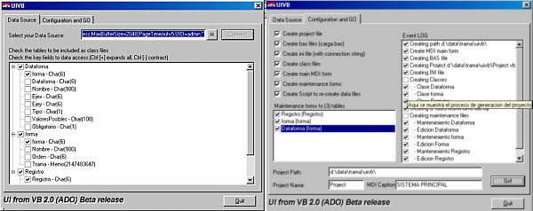



## UIVB \(Source class code generator release 2\.0\)

### Description

Select your data source. Then you can create all the necesary items to make the initial 40% code (Project, MDI menu, browse forms, edit forms) from the selected tables.

It normally reduces my developmnt time in a 50%.

The next step depend on you. It will support file templates, to let you customize the editing forms. If you like this code, please vote for it. And, if I see a good rate, i will take a time to make this 3rd release. Of course, your feedbacks are welcome. I will wait for it.
 
### More Info
 

             |
---                |---
**Submitted On**   |2001-12-06 11:34:12
**By**             |[Grenville Tryon](https://github.com/Planet-Source-Code/PSCIndex/blob/master/ByAuthor/grenville-tryon.md)
**Level**          |Intermediate
**User Rating**    |4.5 (36 globes from 8 users)
**Compatibility**  |VB 6\.0
**Category**       |[Complete Applications](https://github.com/Planet-Source-Code/PSCIndex/blob/master/ByCategory/complete-applications__1-27.md)
**World**          |[Visual Basic](https://github.com/Planet-Source-Code/PSCIndex/blob/master/ByWorld/visual-basic.md)
**Archive File**   |[UIVB\_\(Sour398321262001\.zip](https://github.com/Planet-Source-Code/grenville-tryon-uivb-source-class-code-generator-release-2-0__1-29520/archive/master.zip)

